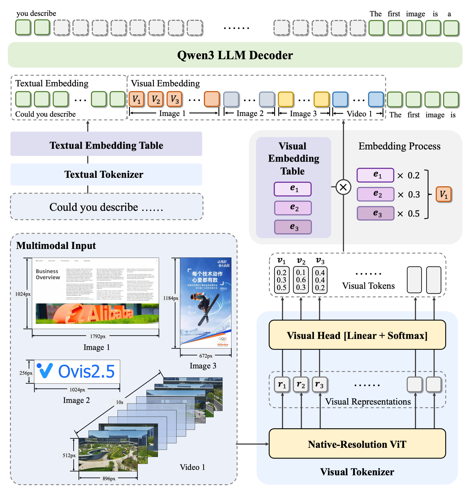
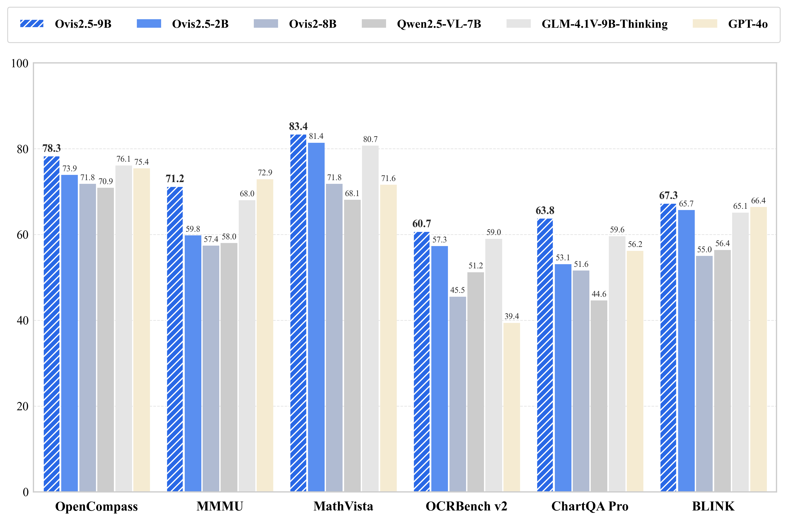
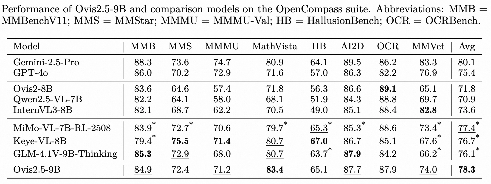

# Ovis: Structural Embedding Alignment for Multimodal Large Language Model

Ovis (Open VISion) is a novel Multimodal Large Language Model (MLLM) architecture, designed to structurally align visual and textual embeddings. For a comprehensive introduction, please refer to the [Ovis2.5 Technical Report](docs/Ovis2_5_Tech_Report.pdf).

<div style="text-align: center;">
  
</div>

## Release
- [25/08/15] 🔥 Launch of [Ovis2.5-2B/9B](https://huggingface.co/AIDC-AI/Ovis2.5-9B), featuring native-resolution visual perception, enhanced reflective reasoning (*thinking mode*), and leading performance across STEM, chart analysis, grounding, and video understanding.
- [25/03/25] 🔥 Announcing quantized versions of Ovis2 series, covering [Ovis2-2/4/8/16/34B](https://huggingface.co/AIDC-AI/Ovis2-34B-GPTQ-Int4)!
- [25/01/26] 🔥 Launch of [Ovis2-1/2/4/8/16/34B](https://huggingface.co/AIDC-AI/Ovis2-34B), the latest version of Ovis models, featuring breakthrough small-model performance, enhanced reasoning capabilities, advanced video and multi-image processing, expanded multilingual OCR support, and improved high-resolution image handling.
- [24/11/26] 🔥 Announcing [Ovis1.6-Gemma2-27B](https://huggingface.co/AIDC-AI/Ovis1.6-Gemma2-27B)!
- [24/11/04] 🔥 Announcing quantized versions of Ovis1.6: [Ovis1.6-Gemma2-9B-GPTQ-Int4](https://huggingface.co/AIDC-AI/Ovis1.6-Gemma2-9B-GPTQ-Int4) and [Ovis1.6-Llama3.2-3B-GPTQ-Int4](https://huggingface.co/AIDC-AI/Ovis1.6-Llama3.2-3B-GPTQ-Int4)!
- [24/10/22] 🔥 Announcing Ovis1.6-Llama3.2-3B ([Model](https://huggingface.co/AIDC-AI/Ovis1.6-Llama3.2-3B), [Demo](https://huggingface.co/spaces/AIDC-AI/Ovis1.6-Llama3.2-3B))!
- [24/09/19] 🔥 Announcing Ovis1.6-Gemma2-9B ([Model](https://huggingface.co/AIDC-AI/Ovis1.6-Gemma2-9B), [Demo](https://huggingface.co/spaces/AIDC-AI/Ovis1.6-Gemma2-9B))! This release further enhances high-resolution image processing, is trained on a larger, more diverse, and higher-quality dataset, and refines the training process with DPO training following instruction-tuning.
- [24/07/24] 🔥 Introducing Ovis1.5, featuring improved high-resolution image processing and optimized training data for enhanced performance.
- [24/06/14] 🔥 Launch of Ovis1.0, the inaugural version of the Ovis model.

## Contents
- [Ovis: Structural Embedding Alignment for Multimodal Large Language Model](#ovis-structural-embedding-alignment-for-multimodal-large-language-model)
  - [Release](#release)
  - [Contents](#contents)
  - [Model](#model)
  - [Performance](#performance)
  - [Inference](#inference)
  - [Citation](#citation)
  - [Team](#team)
  - [🔥 We are hiring!](#-we-are-hiring)
  - [License](#license)
  - [Disclaimer](#disclaimer)

## Model
Ovis can be instantiated with popular LLMs. We provide the following Ovis MLLMs:

| Ovis MLLMs |           ViT           |          LLM          |                      Model Weights                      |                           Demo                           |
|:-----------|:-----------------------:|:---------------------:|:-------------------------------------------------------:|:--------------------------------------------------------:|
| Ovis2.5-2B   | siglip2-so400m-patch16-512 | Qwen3-1.7B | [Huggingface](https://huggingface.co/AIDC-AI/Ovis2.5-2B)  | [Space](https://huggingface.co/spaces/AIDC-AI/Ovis2.5-2B) |
| Ovis2.5-9B   | siglip2-so400m-patch16-512  |  Qwen3-8B  | [Huggingface](https://huggingface.co/AIDC-AI/Ovis2.5-9B)  | [Space](https://huggingface.co/spaces/AIDC-AI/Ovis2.5-9B) |


## Performance
Ovis2.5 demonstrates strong results on general multimodal benchmarks, complex chart analysis, and reasoning tasks, achieving leading performance among open-source models under 40B parameters.








## Inference
Inference instructions and examples will be released soon.  
Please stay tuned for updates in the near future.

## Citation
If you find Ovis useful, please cite the paper
```
@article{lu2025ovis25technicalreport,
  title={Ovis2.5 Technical Report}, 
  author={Shiyin Lu and Yang Li and Yu Xia and Yuwei Hu and Shanshan Zhao and Yanqing Ma and Zhichao Wei and Yinglun Li and Lunhao Duan and Jianshan Zhao and Yuxuan Han and Haijun Li and Wanying Chen and Junke Tang and Chengkun Hou and Zhixing Du and Tianli Zhou and Wenjie Zhang and Huping Ding and Jiahe Li and Wen Li and Gui Hu and Yiliang Gu and Siran Yang and Jiamang Wang and Hailong Sun and Yibo Wang and Hui Sun and Jinlong Huang and Yuping He and Shengze Shi and Weihong Zhang and Guodong Zheng and Junpeng Jiang and Sensen Gao and Yi-Feng Wu and Sijia Chen and Yuhui Chen and Qing-Guo Chen and Zhao Xu and Weihua Luo and Kaifu Zhang},
  year={2025},
  journal={arXiv:2508.11737}
}

@article{lu2024ovis,
  title={Ovis: Structural Embedding Alignment for Multimodal Large Language Model}, 
  author={Shiyin Lu and Yang Li and Qing-Guo Chen and Zhao Xu and Weihua Luo and Kaifu Zhang and Han-Jia Ye},
  year={2024},
  journal={arXiv:2405.20797}
}
```

## Team
This work is a collaborative effort by the Alibaba Ovis team. We would also like to provide links to the following MLLM papers from our team:
- [Parrot: Multilingual Visual Instruction Tuning](https://arxiv.org/abs/2406.02539)
- [Wings: Learning Multimodal LLMs without Text-only Forgetting](https://arxiv.org/abs/2406.03496)

## 🔥 We are hiring!
We are looking for both interns and full-time researchers to join our team, focusing on multimodal understanding, generation, reasoning, AI agents, and unified multimodal models. If you are interested in exploring these exciting areas, please reach out to us at qingguo.cqg@alibaba-inc.com.

## License
This project is licensed under the [Apache License, Version 2.0](https://www.apache.org/licenses/LICENSE-2.0.txt) (SPDX-License-Identifier: Apache-2.0).

## Disclaimer
We used compliance-checking algorithms during the training process, to ensure the compliance of the trained model to the best of our ability. Due to the complexity of the data and the diversity of language model usage scenarios, we cannot guarantee that the model is completely free of copyright issues or improper content. If you believe anything infringes on your rights or generates improper content, please contact us, and we will promptly address the matter.
