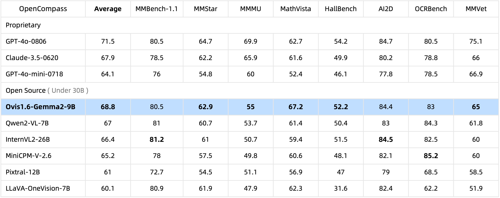
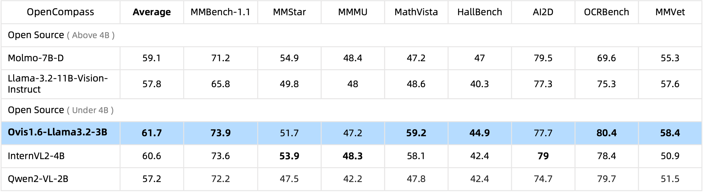

# Ovis: Structural Embedding Alignment for Multimodal Large Language Model

Ovis (Open VISion) is a novel Multimodal Large Language Model (MLLM) architecture, designed to structurally align visual and textual embeddings. For a comprehensive introduction, please refer to the [Ovis paper](https://arxiv.org/abs/2405.20797).

<div style="text-align: center;">
  
</div>

## Release
- [10/22] 🔥 Announcing Ovis1.6-Llama3.2-3B ([Model](https://huggingface.co/AIDC-AI/Ovis1.6-Llama3.2-3B), [Demo](https://huggingface.co/spaces/AIDC-AI/Ovis1.6-Llama3.2-3B))!
- [09/19] 🔥 Announcing Ovis1.6-Gemma2-9B ([Model](https://huggingface.co/AIDC-AI/Ovis1.6-Gemma2-9B), [Demo](https://huggingface.co/spaces/AIDC-AI/Ovis1.6-Gemma2-9B))! This latest release further enhances high-resolution image processing, is trained on a larger, more diverse, and higher-quality dataset, and refines the training process with DPO training following instruction-tuning.
- [07/24] 🔥 Introducing Ovis1.5, featuring improved high-resolution image processing and optimized training data for enhanced performance.
- [06/14] 🔥 Launch of Ovis1.0, the inaugural version of the Ovis model.

## Contents
- [Install](#install)
- [Model](#model)
- [Performance](#performance)
- [Finetune](#finetune)
- [Inference](#inference)
- [Citation](#citation)
- [Team](#team)
- [License](#license)

## Install
Ovis has been tested with Python 3.10, Torch 2.2.0, Transformers 4.44.2, and DeepSpeed 0.14.4. For a comprehensive list of package dependencies, please consult the `requirements.txt` file. Before finetuning or inference, please install Ovis as follows.
```bash
git clone git@github.com:AIDC-AI/Ovis.git
conda create -n ovis python=3.10 -y
conda activate ovis
cd Ovis
pip install -r requirements.txt
pip install -e .
```

## Model
Ovis can be instantiated with popular LLMs. We provide the following Ovis MLLMs:

| Ovis MLLMs        | ViT         | LLM                |                          Model Weights                          | Demo                                                             |
|:------------------|:-----------:|:------------------:|:---------------------------------------------------------------:|:----------------------------------------------------------------:|
| Ovis1.6-Gemma2-9B | Siglip-400M | Gemma2-9B-It       | [Huggingface](https://huggingface.co/AIDC-AI/Ovis1.6-Gemma2-9B) | [Space](https://huggingface.co/spaces/AIDC-AI/Ovis1.6-Gemma2-9B) |
| Ovis1.6-Llama3.2-3B | Siglip-400M | Llama-3.2-3B-Instruct       | [Huggingface](https://huggingface.co/AIDC-AI/Ovis1.6-Llama3.2-3B) | [Space](https://huggingface.co/spaces/AIDC-AI/Ovis1.6-Llama3.2-3B) |

## Performance
With just **10B** parameters, **Ovis1.6-Gemma2-9B** leads the [OpenCompass](https://github.com/open-compass/VLMEvalKit) benchmark among open-source MLLMs within **30B** parameters.



**Ovis1.6-Llama3.2-3B** leads the [OpenCompass](https://github.com/open-compass/VLMEvalKit) benchmark among open-source MLLMs under **4B** parameters, even surpassing Llama-3.2-11B-Vision-Instruct.



## Finetune
Finetuning Ovis1.6-Gemma2-9B is supported in [ms-swift](https://github.com/modelscope/ms-swift).

## Inference
We provide an inference wrapper in `ovis/serve/runner.py`, which can be used as:
```python
from PIL import Image
from ovis.serve.runner import RunnerArguments, OvisRunner
image = Image.open('IMAGE_PATH')
text = 'PROMPT'
runner_args = RunnerArguments(model_path='MODEL_PATH')
runner = OvisRunner(runner_args)
generation = runner.run([image, text])
```
Based on [Gradio](https://github.com/gradio-app/gradio), Ovis can also be accessed via a web user interface:
```bash
python ovis/serve/server.py --model_path MODEL_PATH --port PORT
```

## Citation
If you find Ovis useful, please cite the paper
```
@article{lu2024ovis,
  title={Ovis: Structural Embedding Alignment for Multimodal Large Language Model}, 
  author={Shiyin Lu and Yang Li and Qing-Guo Chen and Zhao Xu and Weihua Luo and Kaifu Zhang and Han-Jia Ye},
  year={2024},
  journal={arXiv:2405.20797}
}
```

## Team
This work is a collaborative effort by the MarcoVL team. We would also like to provide links to the following MLLM papers from our team:
- [Parrot: Multilingual Visual Instruction Tuning](https://arxiv.org/abs/2406.02539)
- [Wings: Learning Multimodal LLMs without Text-only Forgetting](https://arxiv.org/abs/2406.03496)

## License
This project is licensed under the [Apache License, Version 2.0](https://www.apache.org/licenses/LICENSE-2.0.txt) (SPDX-License-Identifier: Apache-2.0).

## Disclaimer
We used compliance-checking algorithms during the training process, to ensure the compliance of the trained model to the best of our ability. Due to the complexity of the data and the diversity of language model usage scenarios, we cannot guarantee that the model is completely free of copyright issues or improper content. If you believe anything infringes on your rights or generates improper content, please contact us, and we will promptly address the matter.
