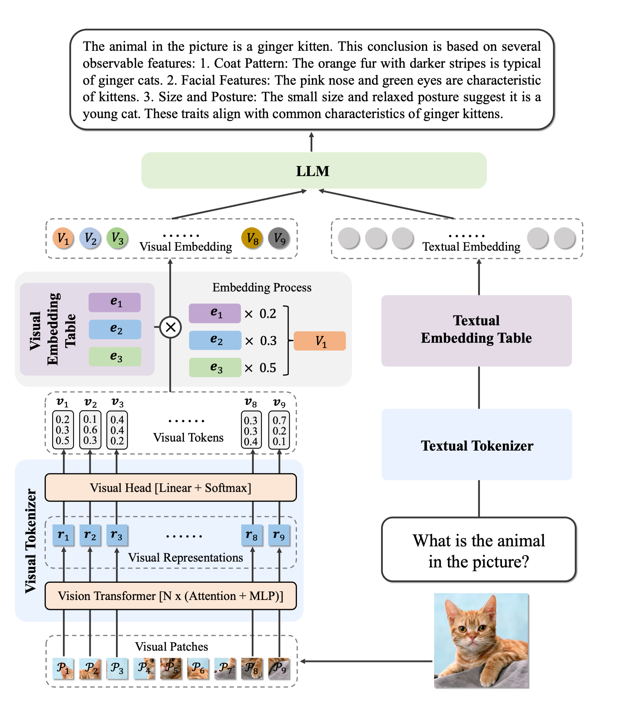

# Ovis: Structural Embedding Alignment for Multimodal Large Language Model

Ovis (Open VISion) is a novel Multimodal Large Language Model (MLLM) architecture, designed to structurally align visual and textual embeddings. For a comprehensive introduction, please refer to the [Ovis paper](https://arxiv.org/abs/2405.20797).

<div style="text-align: center;">
  
</div>

## Release
- [08/07] 🔥 Demos launched on Huggingface: [Ovis1.5-Llama3-8B](https://huggingface.co/spaces/AIDC-AI/Ovis1.5-Llama3-8B) and [Ovis1.5-Gemma2-9B](https://huggingface.co/spaces/AIDC-AI/Ovis1.5-Gemma2-9B)
- [07/24] 🔥 Announcing Ovis1.5, the latest version of Ovis! As always, Ovis1.5 remains fully open-source: we release the [training datasets](https://huggingface.co/datasets/AIDC-AI/Ovis-dataset), [training & inference codes](https://github.com/AIDC-AI/Ovis), and [model weights](https://huggingface.co/AIDC-AI/Ovis1.5-Llama3-8B) for reproducible transparency and community collaboration.
- [06/14] 🔥 We release the [paper](https://arxiv.org/pdf/2405.20797), [code](https://github.com/AIDC-AI/Ovis), [models](https://huggingface.co/AIDC-AI/Ovis-Clip-Llama3-8B), and [datasets](https://huggingface.co/datasets/AIDC-AI/Ovis-dataset).

## Contents
- [Install](#install)
- [Model](#model)
- [Performance](#performance)
- [Dataset](#dataset)
- [Train](#train)
- [Inference](#inference)
- [Citation](#citation)
- [Team](#team)
- [License](#license)

## Install
Ovis has been tested with Python 3.10, Torch 2.1.2, Transformers 4.43.2, and DeepSpeed 0.14.0. For a comprehensive list of package dependencies, please consult the `requirements.txt` file. Before training or inference, please install Ovis as follows.
```bash
git clone git@github.com:AIDC-AI/Ovis.git
conda create -n ovis python=3.10 -y
conda activate ovis
cd Ovis
pip install -r requirements.txt
pip install -e .
```

## Model
Ovis can be instantiated with popular LLMs (e.g., Llama3, Gemma2). We provide the following pretrained Ovis MLLMs:

| Ovis MLLMs               | ViT         | LLM                |                          Model Weights                           |
|:-------------------------|:-----------:|:------------------:|:----------------------------------------------------------------:|
| Ovis1.5-Llama3-8B        | Siglip-400M | Llama3-8B-Instruct | [Huggingface](https://huggingface.co/AIDC-AI/Ovis1.5-Llama3-8B)  |
| Ovis1.5-Gemma2-9B        | Siglip-400M | Gemma2-9B-It       | [Huggingface](https://huggingface.co/AIDC-AI/Ovis1.5-Gemma2-9B)  |

## Performance
We evaluate Ovis1.5 across various multimodal benchmarks using [VLMEvalKit](https://github.com/open-compass/VLMEvalKit) and compare its performance to leading MLLMs with similar parameter scales.

|                   | MiniCPM-Llama3-V2.5 | GLM-4V-9B | Ovis1.5-Llama3-8B | Ovis1.5-Gemma2-9B |
|:------------------|--------------------:|----------:|------------------:|------------------:|
| Open Weights      |                  ✅ |         ✅ |                ✅ |                ✅ |
| Open Datasets     |                  ❌ |         ❌ |                ✅ |                ✅ |
| MMTBench-VAL      |                57.6 |      48.8 |              60.7 |          **62.7** |
| MMBench-EN-V1.1   |                  74 |      68.7 |          **78.2** |              78.0 |
| MMBench-CN-V1.1   |                70.1 |      67.1 |          **75.2** |              75.1 |
| MMStar            |                51.8 |      54.8 |              57.2 |          **58.7** |
| MMMU-Val          |                45.8 |      46.9 |              48.6 |          **49.8** |
| MathVista-Mini    |                54.3 |      51.1 |              62.4 |          **65.7** |
| HallusionBenchAvg |                42.4 |        45 |              44.5 |          **48.0** |
| AI2D              |                78.4 |      71.2 |              82.5 |          **84.7** |
| OCRBench          |                 725 |   **776** |               743 |               756 |
| MMVet             |                52.8 |    **58** |              52.2 |              56.5 |
| RealWorldQA       |                63.5 |        66 |              64.6 |          **66.9** |
| CharXiv Reasoning |                24.9 |         - |              28.2 |          **28.4** |
| CharXiv Descriptive |              59.3 |         - |              60.2 |          **62.6** |


## Dataset
All training datasets are summarized in the JSON file located at `ovis/train/dataset/dataset_info_v1_5.json`. Each dataset entry includes the following attributes:

- **`meta_file`**: This file contains a collection of samples where each sample consists of text and (optionally) image. The text data is embedded directly within the `meta_file`, while the image is represented by its filename. This filename refers to the image file located in the `image_dir`.
- **`image_dir`**: The directory where the images are stored.
- **`data_format`**: Specifies the format of the data, which is used to determine the dataset class for processing the dataset.

We provide the `meta_file` for each training dataset at [Huggingface](https://huggingface.co/datasets/AIDC-AI/Ovis-dataset). The images can be downloaded from their respective sources listed below.

| dataset name                                       |                 image dir |                                                      image source |
|:---------------------------------------------------|--------------------------:|------------------------------------------------------------------:|
| pixelprose-14m                                     |            pixelprose-14m |            `image_url` of each sample in `pixelprose-14m.parquet` |
| wikipedia-348k                                     |            wikipedia-348k |            `image_url` of each sample in `wikipedia-348k.parquet` |
| ocr-469k                                           |                  ocr-469k |                  `image_url` of each sample in `ocr-469k.parquet` |
| allava-*                                           |                    allava |     https://huggingface.co/datasets/FreedomIntelligence/ALLaVA-4V |
| cc12m-description-387k / cc12m-qa-387k             |                ovis_cc12m |              https://huggingface.co/datasets/AIDC-AI/Ovis-dataset |
| A-OKVQA-18k / vsr-train-dev-12k                    |                      COCO |                                           https://cocodataset.org |
| CLEVR-MATH-85k                                     |                CLEVR-MATH |                           https://github.com/dali-does/clevr-math |
| FigureQA-100k                                      |                  FigureQA | https://www.microsoft.com/en-us/research/project/figureqa-dataset |
| Geometry-2k                                        |                Geometry3K |                             https://github.com/lupantech/InterGPS |
| IAM-7k                                             |                  IAM-line |                   https://huggingface.co/datasets/Teklia/IAM-line |
| InfographicVQA-24k / infovqa-multi-conversation-5k |                   InfoVQA |                       https://rrc.cvc.uab.es/?ch=17&com=downloads |
| MathQA-395k                                        |                         - |                                                                 - |
| MathV-360k                                         |                MathV-360K |             https://huggingface.co/datasets/Zhiqiang007/MathV360K |
| MathV-CoT-360k                                     |                MathV-360K |             https://huggingface.co/datasets/Zhiqiang007/MathV360K |
| OpenCQA-5k                                         |                   OpenCQA |                                https://github.com/vis-nlp/OpenCQA |
| PlotQA-157k                                        |                    PlotQA |                           https://github.com/NiteshMethani/PlotQA |
| Super-CLEVR-30k                                    |               Super-CLEVR |                             https://github.com/Lizw14/Super-CLEVR |
| Symbolic-Reasoning-TabMW-31k                       | Symbolic-Reasoning-TabMWP |                                        https://promptpg.github.io |
| ViQuAE-2k                                          |                    ViQuAE |                              https://github.com/PaulLerner/ViQuAE |
| ai2d-mc-15k                                        |                      AI2D |              https://huggingface.co/datasets/AIDC-AI/Ovis-dataset |
| c7s-*                                              |              Cambrian_10M |          https://huggingface.co/datasets/nyu-visionx/Cambrian-10M |
| doclaynet-65k                                      |                 DocLayNet |                   https://huggingface.co/datasets/ds4sd/DocLayNet |
| doclie-real-100k                                   |               ovis-docile |              https://huggingface.co/datasets/AIDC-AI/Ovis-dataset |
| docmatix-si-900k                                   |                  docmatix |            https://huggingface.co/datasets/HuggingFaceM4/Docmatix |
| dtvqa-27k                                          |                    DT-VQA |                           https://github.com/ShuoZhang2003/DT-VQA |
| funsd-1k                                           |                     funsd |                            https://guillaumejaume.github.io/FUNSD |
| hme-74k                                            |                       HME |                                https://github.com/Phymond/HME100K |
| hwl-eng-10k                                        |               HWL_OCR_ENG |                                https://ai.100tal.com/openData/ocr |
| icqa-train-val-40k                                 |                    iconqa |                                         https://iconqa.github.io/ |
| kvqa-25k                                           |                      KVQA |                       http://malllabiisc.github.io/resources/kvqa |
| lrv-instruct-and-chart-343k                        |                       LRV |                      https://github.com/FuxiaoLiu/LRV-Instruction |
| mmc-base-410k                                      |                       MMC |                       https://huggingface.co/datasets/xywang1/MMC |
| mmmath-6k                                          |                    mmmath |                   https://huggingface.co/datasets/THU-KEG/MM_Math |
| ocr-vqa-multi-conversation-207k                    |                   ocr-vqa |                                        https://ocr-vqa.github.io/ |
| okvqa-14k                                          |                    OK-VQA |                              https://okvqa.allenai.org/index.html |
| orandCAR-5k                                        |                 ORAND-CAR |                               https://www.orand.cl/icfhr2014-hdsr |
| poie-9k                                            |                      poie |                                   https://github.com/jfkuang/cfam |
| sroie-3k                                           |                     sroie |       https://www.kaggle.com/datasets/urbikn/sroie-datasetv2/data |
| stvqa-78k                                          |                    ST-VQA |                                     https://rrc.cvc.uab.es/?ch=11 |
| tqa-train-34k                                      |                   textvqa |                                       https://textvqa.org/dataset |
| tqa-train-val-20k                                  |                       TQA |                                      https://allenai.org/data/tqa |
| visualdialog-125k                                  |              VisualDialog |                                          https://visualdialog.org |
| vqa-v2-multi-conversation-184k                     |                       VQA |                                              https://visualqa.org |

Below is an example of the folder structure consistent with `dataset_info_v1_5.json`. You can alter the folder structure as needed and modify `dataset_info_v1_5.json` accordingly.
```
|-- mllm_datasets
    |-- meta_files
        |-- v1
        |-- v1_5
            |-- pixelprose-14m.parquet
            |-- cc12m-description-387k.json
            |-- A-OKVQA-18k.json
            |-- CLEVR-MATH-85k.json
            ...
    |-- images
        |-- pixelprose-14m
        |-- ovis_cc12m
        |-- COCO
        |-- CLEVR-MATH
        ...
```

## Train
Ovis is trained in three stages, with each stage's training scripts located in the `scripts` directory. Before starting the training, ensure you properly set the `ROOT` variable in the scripts. Below are the commands to train Ovis1.5-Llama3-8B:
```bash
bash scripts/v1_5/Ovis1.5-Llama3-8B-S1.sh
bash scripts/v1_5/Ovis1.5-Llama3-8B-S2.sh
bash scripts/v1_5/Ovis1.5-Llama3-8B-S3.sh
```

## Inference
We provide an inference wrapper in `ovis/serve/runner.py`, which can be used as:
```python
from PIL import Image
from ovis.serve.runner import RunnerArguments, OvisRunner
image = Image.open('IMAGE_PATH')
text = 'PROMPT'
runner_args = RunnerArguments(model_path='MODEL_PATH')
runner = OvisRunner(runner_args)
generation = runner.run([image, text])
```
Based on [Gradio](https://github.com/gradio-app/gradio), Ovis can also be accessed via a web user interface:
```bash
python ovis/serve/server.py --model_path MODEL_PATH --port PORT
```

## Citation
If you find Ovis useful, please cite the paper
```
@article{lu2024ovis,
  title={Ovis: Structural Embedding Alignment for Multimodal Large Language Model}, 
  author={Shiyin Lu and Yang Li and Qing-Guo Chen and Zhao Xu and Weihua Luo and Kaifu Zhang and Han-Jia Ye},
  year={2024},
  journal={arXiv:2405.20797}
}
```

## Team
This work is a collaborative effort by the MarcoVL team. We would also like to provide links to the following MLLM papers from our team:
- [Parrot: Multilingual Visual Instruction Tuning](https://arxiv.org/abs/2406.02539)
- [Wings: Learning Multimodal LLMs without Text-only Forgetting](https://arxiv.org/abs/2406.03496)

## License
The project is licensed under the Apache 2.0 License and is restricted to uses that comply with the license agreements of Qwen, Llama3, Gemma2, Clip, and Siglip.
