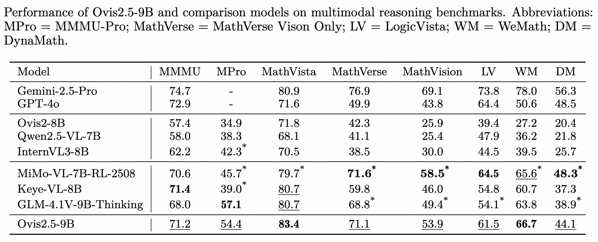

# Ovis
<div align="center">
  
</div>
<br>

<p align="center">
  <a href="https://arxiv.org/abs/2508.11737"></a>
  <a href="https://huggingface.co/spaces/AIDC-AI/Ovis2.5-9B"></a>
  <a href="https://huggingface.co/collections/AIDC-AI/ovis25-689ec1474633b2aab8809335"></a>
</p>

## Introduction

Ovis (Open VISion) is a novel Multimodal Large Language Model (MLLM) architecture, designed to structurally align visual and textual embeddings.

<div style="text-align: center;">
  
</div>

## 🔥 We are hiring!
We are looking for both interns and full-time researchers to join our team, focusing on multimodal understanding, generation, reasoning, AI agents, and unified multimodal models. If you are interested in exploring these exciting areas, please reach out to us at qingguo.cqg@alibaba-inc.com.

## Release
- [25/08/15] 🔥 Launch of [Ovis2.5-2B/9B](https://huggingface.co/AIDC-AI/Ovis2.5-9B), featuring native-resolution visual perception, enhanced reflective reasoning (*thinking mode*), and leading performance across STEM, chart analysis, grounding, and video understanding.
- [25/03/25] 🔥 Announcing quantized versions of Ovis2 series, covering [Ovis2-2/4/8/16/34B](https://huggingface.co/AIDC-AI/Ovis2-34B-GPTQ-Int4)!
- [25/01/26] 🔥 Launch of [Ovis2-1/2/4/8/16/34B](https://huggingface.co/AIDC-AI/Ovis2-34B), the latest version of Ovis models, featuring breakthrough small-model performance, enhanced reasoning capabilities, advanced video and multi-image processing, expanded multilingual OCR support, and improved high-resolution image handling.
- [24/11/26] 🔥 Announcing [Ovis1.6-Gemma2-27B](https://huggingface.co/AIDC-AI/Ovis1.6-Gemma2-27B)!
- [24/11/04] 🔥 Announcing quantized versions of Ovis1.6: [Ovis1.6-Gemma2-9B-GPTQ-Int4](https://huggingface.co/AIDC-AI/Ovis1.6-Gemma2-9B-GPTQ-Int4) and [Ovis1.6-Llama3.2-3B-GPTQ-Int4](https://huggingface.co/AIDC-AI/Ovis1.6-Llama3.2-3B-GPTQ-Int4)!
- [24/10/22] 🔥 Announcing Ovis1.6-Llama3.2-3B ([Model](https://huggingface.co/AIDC-AI/Ovis1.6-Llama3.2-3B), [Demo](https://huggingface.co/spaces/AIDC-AI/Ovis1.6-Llama3.2-3B))!
- [24/09/19] 🔥 Announcing Ovis1.6-Gemma2-9B ([Model](https://huggingface.co/AIDC-AI/Ovis1.6-Gemma2-9B), [Demo](https://huggingface.co/spaces/AIDC-AI/Ovis1.6-Gemma2-9B))! This release further enhances high-resolution image processing, is trained on a larger, more diverse, and higher-quality dataset, and refines the training process with DPO training following instruction-tuning.
- [24/07/24] 🔥 Introducing Ovis1.5, featuring improved high-resolution image processing and optimized training data for enhanced performance.
- [24/06/14] 🔥 Launch of Ovis1.0, the inaugural version of the Ovis model.

## Contents
- [Ovis: Structural Embedding Alignment for Multimodal Large Language Model](#ovis-structural-embedding-alignment-for-multimodal-large-language-model)
  - [Release](#release)
  - [Contents](#contents)
  - [Model](#model)
  - [Performance](#performance)
  - [Install](#install)
  - [Inference](#inference)
  - [Model Fine-tuning](#model-fine-tuning)
  - [Citation](#citation)
  - [Team](#team)
  - [License](#license)
  - [Disclaimer](#disclaimer)

## Model
Ovis can be instantiated with popular LLMs. We provide the following Ovis MLLMs:

| Ovis MLLMs |           ViT           |          LLM          |                      Model Weights                      |                           Demo                           |
|:-----------|:-----------------------:|:---------------------:|:-------------------------------------------------------:|:--------------------------------------------------------:|
| Ovis2.5-2B   | siglip2-so400m-patch16-512 | Qwen3-1.7B | [Huggingface](https://huggingface.co/AIDC-AI/Ovis2.5-2B)  | [Space](https://huggingface.co/spaces/AIDC-AI/Ovis2.5-2B) |
| Ovis2.5-9B   | siglip2-so400m-patch16-512  |  Qwen3-8B  | [Huggingface](https://huggingface.co/AIDC-AI/Ovis2.5-9B)  | [Space](https://huggingface.co/spaces/AIDC-AI/Ovis2.5-9B) |


## Performance
Ovis2.5 demonstrates strong results on general multimodal benchmarks, complex chart analysis, and reasoning tasks, achieving leading performance among open-source models under 40B parameters.




## Install
Ovis has been tested with Python 3.10, Torch 2.4.0, Transformers 4.51.3, and DeepSpeed 0.15.4. For a comprehensive list of package dependencies, please consult the `requirements.txt` file.
```bash
git clone git@github.com:AIDC-AI/Ovis.git
conda create -n ovis python=3.10 -y
conda activate ovis
cd Ovis
pip install -r requirements.txt
pip install -e .
```

For `vLLM`:

```bash
pip install vllm==0.10.2 --extra-index-url https://wheels.vllm.ai/0.10.2/
```

## Inference

We provide inference examples using both **transformers** and **vLLM**.

### transformers

In `ovis/serve` we provide three example files:

* **`ovis/serve/infer_think_demo.py`**  
  Demonstrates how to enable the model’s *reflective reasoning* via  
  `enable_thinking` and to control the reasoning phase length with `thinking_budget`.

* **`ovis/serve/infer_basic_demo.py`**  
  Provides inference examples for single-image, multi-image, video, and pure-text inputs.

* **`ovis/serve/web_ui.py`**
  Provides a **Gradio-based Web UI** demo.
  Example run:

  ```bash
  python ovis/serve/web_ui.py --model-path AIDC-AI/Ovis2.5-9B --port 8001
  ```

### vLLM

Start the vLLM server:

```bash
vllm serve AIDC-AI/Ovis2.5-9B \
     --trust-remote-code \
     --port 8000
```

Call the model using the **OpenAI Python SDK**:

```python
from openai import OpenAI

openai_api_key = "EMPTY"
openai_api_base = "http://localhost:8000/v1"

client = OpenAI(
    api_key=openai_api_key,
    base_url=openai_api_base,
)

chat_response = client.chat.completions.create(
    model="AIDC-AI/Ovis2.5-9B",
    messages=[
        {
            "role": "user",
            "content": [
                {
                    "type": "image_url",
                    "image_url": {
                        "url": "https://cdn-uploads.huggingface.co/production/uploads/637aebed7ce76c3b834cea37/kh-1dhZRAduP-P4SkIhXr.png"
                    },
                },
                {"type": "text", "text": "Recognize the table content"},
            ],
        },
    ],    
    extra_body={
        "chat_template_kwargs": {
            "enable_thinking": True,
        },
        "mm_processor_kwargs": {
            "images_kwargs": {
                "min_pixels": 1048576,   # 1024 * 1024
                "max_pixels": 3211264    # 1792 * 1792
            }
        }
    }
)

print("Chat response:\n", chat_response.choices[0].message.content)
```

#### Explanation of `extra_body` parameters:

* **`chat_template_kwargs.enable_thinking`**
  Enables *thinking mode* (reflective reasoning).

* **`mm_processor_kwargs.images_kwargs.min_pixels / max_pixels`**
  Controls the resolution range of input images (in total pixel count), balancing accuracy and GPU memory usage.


## Model Fine-tuning

Ovis can be fine-tuned using either the provided training code in this repository or via [ms-swift](https://github.com/modelscope/ms-swift).


### 1. Fine-tuning with in-repo code

#### Data Format

The training dataset is stored as a **JSON list**, where each element corresponds to a single sample.
Example dataset JSON:

```jsonc
[
    {
        "id": 1354,
        "image": "1354.png",
        "conversations": [
            {
                "from": "human",
                "value": "<image>\nIn the figure, the vertices of quadrilateral ABCD intersect square EFGH and divide its sides into segments with measures that have a ratio of 1:2. Find the ratio between the areas of ABCD and EFGH."
            },
            {
                "from": "gpt",
                "value": "5:9"
            }
        ]
    }
]
```

#### Dataset Information

Datasets are referenced via **datainfo JSON files**, e.g. `ovis/train/dataset/ovis2_5_sft_datainfo.json`:

```json
{
    "geometry3k_local": {
        "meta_file": "path/to/geometry3k_local.json",
        "storage_type": "hybrid",
        "data_format": "conversation",
        "image_dir": "path/to/images/"
    }
}
```

* `meta_file`: path to the converted dataset JSON file (a list of samples).
* `storage_type`: usually set to `"hybrid"`.
* `data_format`: usually set to `"conversation"`.
* `image_dir`: directory path containing the referenced images.

#### Training Script

We provide example training scripts under `scripts/`.
For instance, to fine-tune Ovis2.5 with SFT:

```bash
bash scripts/run_ovis2_5_sft.sh
```

This script configures the DeepSpeed engine, dataset paths, and model checkpoint initialization. Modify it to match your own dataset and environment.

### 2. Fine-tuning with ms-swift

Alternatively, Ovis models can be fine-tuned using [ms-swift](https://github.com/modelscope/ms-swift), a flexible training framework for LLMs.


## Citation
If you find Ovis useful, please cite the paper
```
@article{lu2025ovis25technicalreport,
  title={Ovis2.5 Technical Report}, 
  author={Shiyin Lu and Yang Li and Yu Xia and Yuwei Hu and Shanshan Zhao and Yanqing Ma and Zhichao Wei and Yinglun Li and Lunhao Duan and Jianshan Zhao and Yuxuan Han and Haijun Li and Wanying Chen and Junke Tang and Chengkun Hou and Zhixing Du and Tianli Zhou and Wenjie Zhang and Huping Ding and Jiahe Li and Wen Li and Gui Hu and Yiliang Gu and Siran Yang and Jiamang Wang and Hailong Sun and Yibo Wang and Hui Sun and Jinlong Huang and Yuping He and Shengze Shi and Weihong Zhang and Guodong Zheng and Junpeng Jiang and Sensen Gao and Yi-Feng Wu and Sijia Chen and Yuhui Chen and Qing-Guo Chen and Zhao Xu and Weihua Luo and Kaifu Zhang},
  year={2025},
  journal={arXiv:2508.11737}
}

@article{lu2024ovis,
  title={Ovis: Structural Embedding Alignment for Multimodal Large Language Model}, 
  author={Shiyin Lu and Yang Li and Qing-Guo Chen and Zhao Xu and Weihua Luo and Kaifu Zhang and Han-Jia Ye},
  year={2024},
  journal={arXiv:2405.20797}
}
```

## Team
This work is a collaborative effort by the Alibaba Ovis team. We would also like to provide links to the following MLLM papers from our team:
- [Parrot: Multilingual Visual Instruction Tuning](https://arxiv.org/abs/2406.02539)
- [Wings: Learning Multimodal LLMs without Text-only Forgetting](https://arxiv.org/abs/2406.03496)

## License
This project is licensed under the [Apache License, Version 2.0](https://www.apache.org/licenses/LICENSE-2.0.txt) (SPDX-License-Identifier: Apache-2.0).

## Disclaimer
We used compliance-checking algorithms during the training process, to ensure the compliance of the trained model to the best of our ability. Due to the complexity of the data and the diversity of language model usage scenarios, we cannot guarantee that the model is completely free of copyright issues or improper content. If you believe anything infringes on your rights or generates improper content, please contact us, and we will promptly address the matter.
